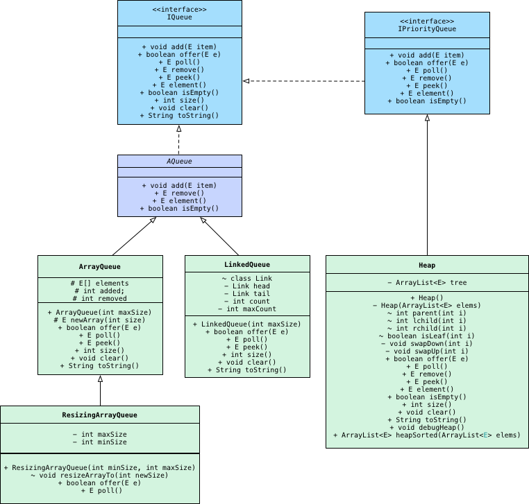
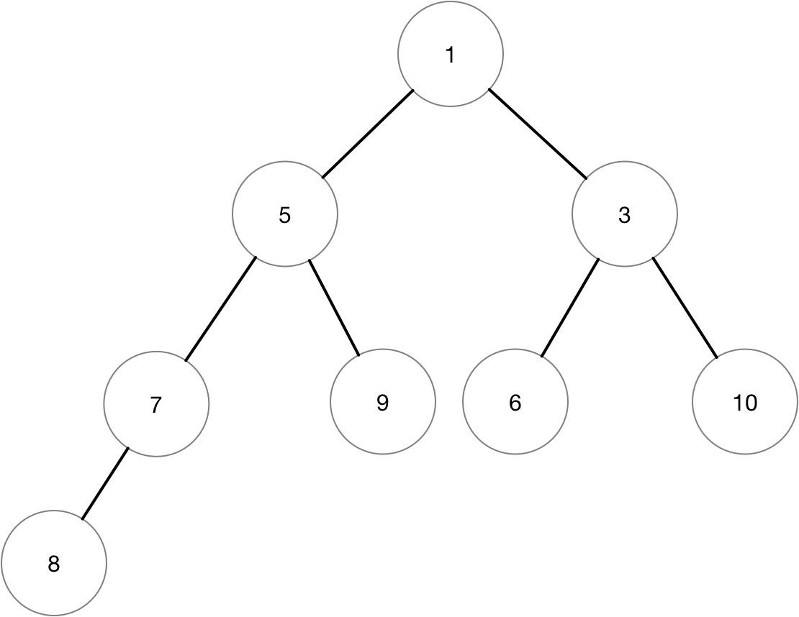
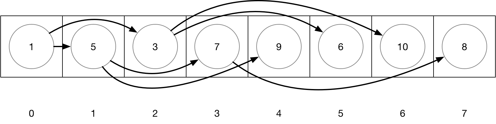
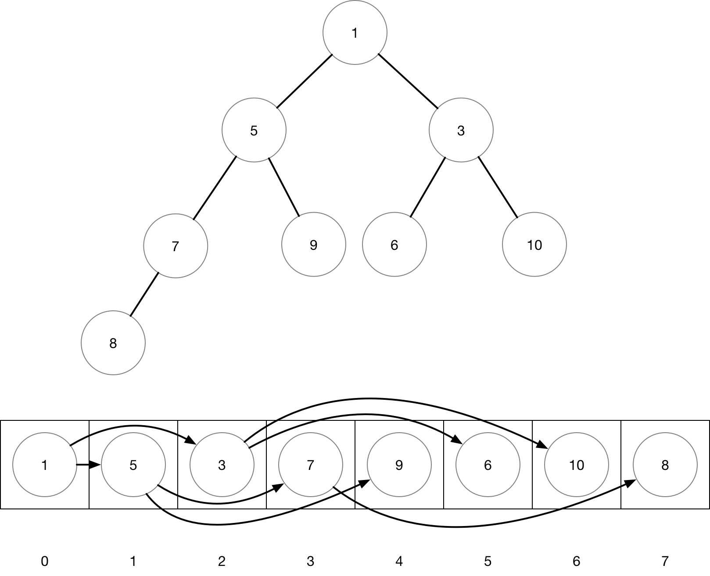

= CS165 Programming Lab Assignment: Priority Queues

== Heap Implementation

.Objectives

* Create a priority queue using a heap data structure.
* Create a heap data structure using an `ArrayList` representing a complete binary tree.
* Observe another way to provide default method implementations.
** We've already seen shared code in an abstract base class.
** Now we'll see shared code in the interface itself

.Getting Started

Import link:../archive/Heap-starter.jar[`Heap-starter.jar`] into your PriorityQueues project.

Your directory should look like this:

----
PriorityQueues/
└── src
    ├── AQueue.java
    ├── ArrayQueue.java
    ├── Heap.java
    ├── IPriorityQueue.java
    ├── IQueue.java
    ├── LinkedQueue.java
    ├── QueueTestProgram.java
    └── ResizingArrayQueue.java
----

And now your class structure can be represented using the following UML diagram:

This recitation is an optional partner recitation. I encourage you guys to discuss implementation details
and to actively discuss the different topics that this week's recitations approach. You don't need to
have the same partner as the last recitation.

If you choose to work with a partner and do not complete the required work, then it is your
responsibility to finish the lab on your own. Each person should type their own code. I also
recommend coming back to this recitation on your own time and seeing how fast you can implement it
without help from other students or TAs. This is something you can be asked to implement on
a technical interview.

.Description

Priority queues always give the highest priority element in the queue, rather than the element
that has been in the queue for the longest time (a FIFO queue). Priority queues are useful
building blocks in designing other algorithms and data structures. They can also be used to
sort things! You can implement a priority queue in many different ways. An efficient and
beautiful algorithm for this task is a binary heap data structure.

A binary heap is conceptually a binary tree; there is a special element known as the root.
The root has up to two children. The children may each have up to two children. So on and so forth.

A binary heap is a special binary tree that organizes the elements based on their relative priority.
The rule is: every element in the tree is has at least as much priority as any of its children.
Thus the root is a maximum priority element among all elements in the heap.

There are simple algorithms for adding an element to a heap and removing an element from a heap:

* To add an element:
** Make it the child of any element in the tree with fewer than two children.
*** _For efficiency and the purposes of this class, we want to maintain a
    link:http://web.cecs.pdx.edu/~sheard/course/Cs163/Doc/FullvsComplete.html[complete tree]._
** Then check if it is higher priority than its parent. If it is, swap the two elements in the tree.
*** Now check its priority relative to the grandparent, swapping if there is a priority inversion.
*** Repeat as necessary.
* To remove an element:
** A highest priority element is the root element. Removing it might leave children without a parent.
*** Swap a leaf element (an element with no children) with the root element.
*** Remove the old root element from the tree, which is ok since it now has no children.
** Since the new root may not be at least as priority as both its children, check its priority
   relative to both its children.
*** If the highest priority child is higher priority than the new root, swap them in the tree.
*** Now check its priority relative to its new children, swapping if there is a priority inversion.
*** Repeat as necessary.

NOTE: *In this class we will only consider using complete trees.* We do this because it guarantees
      efficiency. Heap operations on a complete tree are O(log(n)). Also, we can then represent the
      tree with contiguous memory slots (arrays or growable-arrays), which further improves efficiency
      by a constant factor.

In this recitation you will build a heap data structure using an `ArrayList` to represent the tree.

Here are some properties of the tree:

* The root element is defined to be at index 0 of the list.
* To access the:
** parent of index i: `(i-1) / 2`
** left child of index i: `2*i + 1`
** right child of index i: `2*i + 2`

Thus, the children of the root are stored at indices 1 and 2. The children of 2 are stored in 5 and 6.

When adding a new element, add it at the next available position in the array. This ensures that
the tree remains a complete binary tree. When removing the root, swap it with the highest index
element in the tree before removal. This ensures that the tree stays complete.

.Instructions

Follow the link:javadoc/Heap.html[javadocs!]

When finished, the sample code in `Heap.main` may print this out.
----
Heap debug:
PARENT: 3 LEFT CHILD: 7 RIGHT CHILD: 5
PARENT: 7 LEFT CHILD: 9 RIGHT CHILD: 8
Heap debug:
 PARENT: 1 LEFT CHILD: 9 RIGHT CHILD: 5
Heap debug:
 PARENT: 1 LEFT CHILD: 3 RIGHT CHILD: 5
 PARENT: 3 LEFT CHILD: 9 RIGHT CHILD: 7
Heap debug:
 PARENT: 0 LEFT CHILD: 3 RIGHT CHILD: 1
 PARENT: 3 LEFT CHILD: 9 RIGHT CHILD: 7
 PARENT: 1 LEFT CHILD: 5 RIGHT CHILD: 8
0
Heap debug:
 PARENT: 1 LEFT CHILD: 3 RIGHT CHILD: 5
 PARENT: 3 LEFT CHILD: 9 RIGHT CHILD: 7
 PARENT: 5 LEFT CHILD: 8
1
Heap debug:
 PARENT: 3 LEFT CHILD: 7 RIGHT CHILD: 5
 PARENT: 7 LEFT CHILD: 9 RIGHT CHILD: 8
3
Heap debug:
 PARENT: 5 LEFT CHILD: 7 RIGHT CHILD: 8
 PARENT: 7 LEFT CHILD: 9
Heap debug:
 PARENT: 4 LEFT CHILD: 5 RIGHT CHILD: 8
 PARENT: 5 LEFT CHILD: 9 RIGHT CHILD: 7
Heap debug:
 PARENT: 2 LEFT CHILD: 5 RIGHT CHILD: 4
 PARENT: 5 LEFT CHILD: 9 RIGHT CHILD: 7
 PARENT: 4 LEFT CHILD: 8
Heap debug:
 PARENT: 2 LEFT CHILD: 5 RIGHT CHILD: 4
 PARENT: 5 LEFT CHILD: 9 RIGHT CHILD: 7
 PARENT: 4 LEFT CHILD: 8 RIGHT CHILD: 4
----

Once you have tested you methods individually, run your heap implementation
through test cases using `QueueTestProgram`.
// TODO link to generative testing documentation, use Queue recit as starter

===== Submission

To receive credit for this recitation show your TA or helper that you have
completed the code for `Heap.java`, tested each method individually, and then sanity checked
your program by running it through test cases using `QueueTestProgram`.
